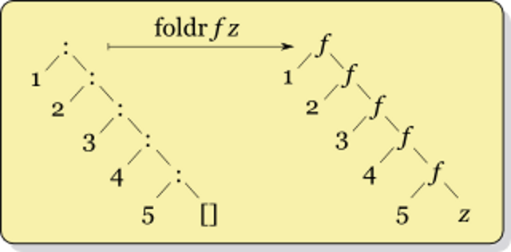
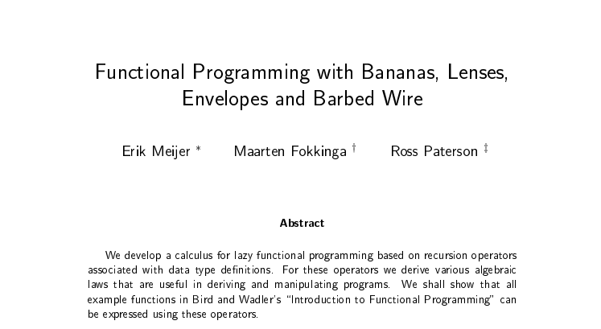
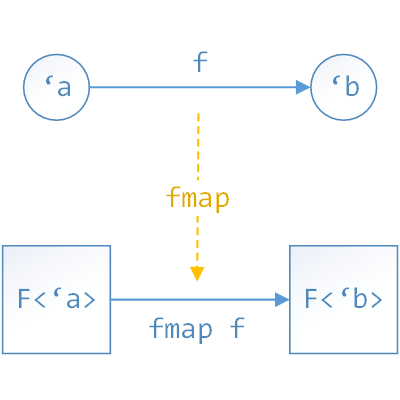
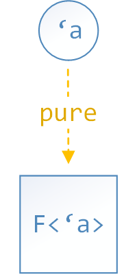
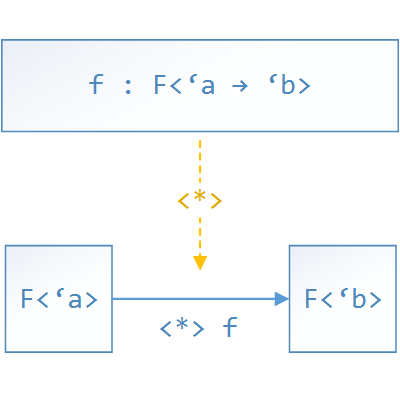

- title : Eventsourcing mit F#
- description : F# und RemmiDemmi Vortrag
- author : Carsten König
- theme : beige
- transition : default

***

##

# Eventsourcing mit F#

## Carsten König

- Slides: [carstenkoenig.github.io/RemmiDemmi](https://carstenkoenig.github.io/RemmiDemmi/#/)
- Code: [github.com/CarstenKoenig/RemmiDemmi](https://github.com/CarstenKoenig/RemmiDemmi)

***

# Eventsourcing?

' - Speichern von Zuständen
' - "funktionale" Datenbank

---

## Eventsourcing?

nicht der **Zustand**

sondern die **Ereignisse**

die zu diesem Zustand geführt haben werden gespeichert.

' - also der Weg zum Zustand

---

## Beispiel Konto

---

## Anstatt

Speichern des aktuellen **Zustands = Guthaben**

> jetzt beträgt ihr Guthaben `15€`

' ich glaube so funktioniert das auf der Bank nicht

---

## Ereignisse

werden **Ereignisse** gespeichert

- am `01.01` wurde das Konto `Eröffnet`
- am `01.01` erfolgte eine `Einzahlung` von `50€`
- am `02.01` erfolgte eine `Auszahlung` von `40€`
- am `03.01` erfolgte eine `Einzahlung` von `5€`
- ...

' kann schon eher sein ... so in etwa

---

## Dabei

Werden Ereignisse *nur* **angehängt**

---

## Dabei

Werden Ereignisse **nie** *gelöscht* oder *geändert*

' bei Fehlern also Ausgleichsbuchungen

---

## Begriffe

- **Aggregate**  = das *Domänen-Objekt* für das wir uns interessieren (*Konto*)
- **Event**      = beschreibt eine **erfolgte** Änderung an einem Aggregat (*Ein-/Auszahlungen*)
- **Stream**     = Abfolge von Ereignissen eines bestimmten Aggregats
- **Projektion** = Berechnen eines Zustands aus den Ereignissen eines Aggregats
- **Snapshot**   = gespeicherter Zustand

' - so verwende ich das hier
' - Snapshot: 
'   - nützlich wenn sehr viele Ereignisse per Aggregat
'   - Speichert kummulierten Zustand, damit nur Ereignisse ab dort benutzt werden müssen
'   - wird hier Abhängig von Projektionen sein

---

## Heute geht es um ...

Wie bekomme ich **Zustand** aus **Ereignissen**?

' - also wie Ereignisse persistiert werden
' - Im Code einfach mit Object-Listen
' - Funktioniert im Prinzip in dem box/unbox mit To/FromJson ersetzt wird
' - Vorsicht: ziemlich übler Reflection-Code
' - ... funktioniert nicht unter Mono

***

# Szenario

' - Filme und Bewertungen
' - zu Remmi Demmi ist mir jetzt nur das eingefallen

---

- Titel: *Project X*
- Genre: *Comedy*
- Laufzeit: *88min*
- Bewertung: *2/3*

(Quelle: [IMDb](http://www.imdb.com/title/tt1636826/?ref_=nv_sr_1))

---

## Model

    type Ereignisse =
	  | FilmAngelegt         of Titel * Genre
	  | LaufzeitHinzugefuegt of Laufzeit
	  | Bewertet             of Bewerter * Sterne
		
    type Sterne = 
	  | EinStern 
	  | ZweiSterne 
	  | DreiSterne
		
' vielleicht Laufzeit später hinzugefügt

---

## Projektionen

- Was ist der **Titel** des Films?
- Wie sieht die **Durchschnittsbewertung** aus?
- ...

---

## Ziel

    type Film =
	  {
	    Titel : Titel
	    Genre : Genre
	    Laufzeit : Laufzeit
	    Bewertung : decimal
	    AnzahlBewertungen : int
	  }
	  
' aus Einzelkomponenten

---

***

# "klassischer" Ansatz

---

## OO-ish

- *Aggregate* = Klasse mit Zustand
- *Apply* - Methode
- `Seq.*` Funktionen

---

	type FilmAggregate (state : Film, bewertungen : decimal list) =

      static member Initial =
        FilmAggregate (emptyFilm, [])

' Zustand: Film-Objekt und eine Liste mit Bewertungen
' `Film` alleine reicht nicht
' könnte man auch *mutable* machen

---

	type FilmAggregate (state : Film, bewertungen : decimal list) =

      member __.Apply (ev : Ereignisse) =
        match ev with
        | FilmAngelegt (titel, genre) ->
            let state' = { state with Titel = titel
                                      Genre = genre }
            FilmAggregate (state', bewertungen)
      
	    | LaufzeitHinzugefuegt laufzeit ->
            let state' = { state with Laufzeit = laufzeit }
            FilmAggregate (state', bewertungen)
        
	    | Bewertet (_, sterne) ->
            let bewertungen' = decimal sterne.Int :: bewertungen
            let state' = { state with AnzahlBewertungen = bewertungen'.Length
                                      Bewertung = Seq.average bewertungen' }
            FilmAggregate (state', bewertungen')

' Funktion zum *anwenden" eines Ereignissen

---

	type FilmAggregate (state : Film, bewertungen : decimal list) =

      static member FromEvents : Ereignisse seq -> FilmAggregate =
        Seq.fold
           (fun (agg : FilmAggregate) -> agg.Apply)
           FilmAggregate.Initial
		   
' im wesentlichen Fold
' hier wären wir fertig - Aggregate als Snapshot
' es gibt einen alternativen Ansatz

---

# Demo

---

## alternativer Ansatz

- Konzentration auf *Fold*/*Projektion*
- diese *kombinierbar* machen

***

# Folds

' ein Schnelleinführung wie Folds funktionieren bzw. hergeleitet werden können

---

    let rec length (xs : 'a list) =
	  match xs with
	  | []      -> 0
	  | (_::xs) -> 1 + length xs
	  
' Teile vorstellen:
' - Aufbau ein Fall per Konstruktor
' - rekursiver Aufruf innerhalb einer Funktion

---

    let rec sum (xs : int list) =
	  match xs with
	  | []      -> 0
	  | (x::xs) -> x + sum xs

---

    let rec map (f : 'a -> 'b) (xs : 'a list) =
	  match xs with
	  | []      -> []
	  | (x::xs) -> f x :: map f xs
		
---		

## Muster

    let rec fold f init xs =
	  match xs with
	  | []      -> init
	  | (x::xs) -> f x (fold f init xs)
		
mit

	f           : 'a -> 's -> 's
    init        : 's
    xs          : 'a list
	fold f init : 'a list -> 's
	
' - Versuch Typen herzuleiten

---		

## length

    let rec length (xs : 'a list) =
	  match xs with
	  | []      -> 0
	  | (x::xs) -> 1 + (length xs)
		
also

	length = fold (fun x s -> 1+s) 0

---		

## sum

    let rec sum (xs : int list) =
	  match xs with
	  | []      -> 0
	  | (x::xs) -> x + (sum xs)
		
also
	
	sum = fold (fun x s -> x+s) 0

---		

## map

    let rec map (g : 'a -> 'b) (xs : 'a list) =
	  match xs with
	  | []      -> []
	  | (x::xs) -> g x :: (map g xs)
		
also

    map g = fold (fun x s -> g x :: s) []
	
---

## FoldR

- Ersetze alle *cons* durch eine Funktion
- Ersetze `[]` durch einen passenden Wert

---

## Universelle Eigenschaft

Jede Funktion `g` der Form

     g []      = init
	 g (x::xs) = f x (g xs)

kann durch

     g = foldr f init
	 
dargestellt werden	 

' ziemlich offensichtlich oder?

---

## LeftFold

	let rec foldl f acc xs = 
	  match xs with
	  | []      -> acc
	  | (x::xs) -> foldl f (f x acc) x
	  
' - viel nützlicher für *strikte* Sprachen
' - also auch F#
' - benutzt einen Akkumulator
' - dieser Akkumulator **ist der Snapshot**
' - schöne Übung: foldl durch foldr und cont

---

## In F#

als

- `Seq.foldBack` bzw. `List.foldBack`
- `Seq.fold` bzw. `List.fold`

---

### Beispiel

	let bewertungFold (evs : Ereignisse seq) =
	  let zaehle (anz, sum) =
	    function
		| Bewertet (_, b) -> (anz + 1, sum + decimal b.Int)
		| _               -> (anz, sum)
	  Seq.fold zaehle (0, 0m) evs
	  |> (fun (anz, sum) ->
        if anz > 0 then
	      sum / decimal anz
	    else
	      0m)
				
' zeigt warum Proj für den Funktor eine gute Idee ist				
				
---

## noch nicht genug?

Folds können selbst *generalisiert* werden ... **Catamorphisms**

[Meijer, Fokkinga, Paterson (1991)](http://eprints.eemcs.utwente.nl/7281/01/db-utwente-40501F46.pdf)

***

# Projektionen

' - Bestandteile des Fold in Datentyp
' - diesen komponierbar machen

---

## Datentypen...

	type Projection<'snap, 'event, 'result> = {
      Fold : 'snap -> Event<'event> -> 'snap
      Proj : 'snap -> 'result
      Init : 'snap
      }
	
mit

	type Event<'event> = {
      Event : 'event
      Meta  : MetaData
      }

	type MetaData = {
      Id        : AggregateId
      Version   : AggregateVersion
      }
	  
' Metadaten nach belieben erweitern (Zeitstempel, ...)
	
---

## Interface

	type IEventStream<'event> =
	  // ...
      abstract Read : Projection<'snap,'event,'res> -> VersionBound -> 'res

' statt Ereignisse zu liefern - überlasse ich den Stream den Fold
' außer `Seq.fold` sparen noch nicht viel gewonnen

---

## Kombinatoren

    let createP f i p : Projection<_,_,_> = { 
	  Fold = fun snap withMeta -> f snap withMeta.Event
      Init = i
      Proj = p 
	  }

---

## Kombinatoren

    let inline sumByP (select : 'event -> 'num option) =
	  createP
	    (fun sum ev ->
	      match select ev with
	      | Some nr -> sum + nr
          | None    -> sum)
         LanguagePrimitives.GenericZero
         id

---

## Kombinatoren

    let countByP (select : 'event -> bool) =
	  let toNum = 
        function 
        | true  -> Some 1 
        | false -> None
      sumByP (select >> toNum)

' bauen also die Funktionen aus `Seq`-Modul nach
' **Basis**-Bausteine

---

## Beispiel

	let anzahlBewertungen : Projection<_,_,int> =
	  let istBewertung =
	    function
	    | Bewertet _ -> true
	    | _          -> false
	  countByP istBewertung

***

# "parallele" Projektionen

' Ziel: mehrere Projektionen mit nur einem Durchlauf

---

## Idee

Übergang zu **Paaren** von *Projektionen*

- Zustand → Zustand A * Zustand B
- komponentenweise `Fold`
- komponentenweise `Proj`

---

    type Pair<'a,'b> = { 
	  First : 'a
	  Second : 'b 
    }

    let parallelP
	  ( pa : Projection<'sa, 'event, 'ra>
      , pb : Projection<'sb, 'event, 'rb>) 
      : Projection<Pair<'sa,'sb>, 'event, 'ra*'rb> =
	{ 
	  Init = { First = pa.Init; Second = pb.Init } 
	  
	  Proj = fun pair -> 
		  ( pa.Proj pair.First
		  , pb.Proj pair.Second)
		
	  Fold = fun pair ev ->
		  let fst = pa.Fold pair.First ev
		  let snd = pb.Fold pair.Second ev
		  { pair with 
			  First = fst
			  Second = snd }
	}
		
' auf den Ausgabe-Typ hinweisen

---

## Problem

Verlieren etwas die Kontrolle über den *Ergebnis*-Typ

' Math for the win: Funktor Muster

***

# Funktor

---

---

## Beispiele

- Listen mit `List.map`
- `Option`s mit `Option.map`
- `type Reader<'src, 'a> = 'src -> 'a` mit `<<`

---

## für Projektionen

    let fmap 
	  (f : 'a -> 'b) 
	  (pa : Projection<'s,'event,'a>) 
	  : Projection<'s,'event,'b> =
	  {
	    Init = pa.Init
	    Fold = pa.Fold
	    Proj = pa.Proj >> f
	  }

---

## Gesetze

- `fmap id = id`
- `fmap (g << f) = fmap g << fmap f`

*geschenkt*, weil Funktionen/Komposition

---

## Beispiel

	let bewertung : Projection<_, Ereignisse, decimal> =
      parallelP (anzahlBewertungen, summeBewertungen)
      |> fmap
        (fun (anz,bew) ->
           if anz > 0
           then bew / decimal anz
           else 0m)	
---

### damit

	let filmP =
		parallelP (titelP,
			parallelP (genreP, 
				parallelP (laufzeitP, 
					parallelP (anzahlP, bewertungenP))))
	    |> fmap (fun (titel, (genre, (laufz, (anz, bew))))) ->
	      {
			Titel             = titel
			Genre             = genre
			Laufzeit          = laufz
			AnzahlBewertungen = anzahl
			Bewertung         = bewertung
	      })

' Kombonierbar: check
' Leserlich/Ease of use ... 

***

# applikativer Funktor

---

---

' Beispiele Analog Functor
' Kein appl. Funktor: (r,_) wegen pure
' für Listen gibt es mehrere Möglichkeiten

---

## für Projektionen

    let pureP value =
        {
            Proj = fun _ -> value
            Init = ()
            Fold = fun _ _ -> ()
        }

    let aMap   
        (pf : Projection<'sf,'event,'a -> 'b>) 
        (pa : Projection<'sa,'event,'a>) 
        : Projection<Pair<'sf,'sa>,'event,'b> =
        parallelP (pf, pa)
        |> fmap (fun (f,a) -> f a)
		
---

## Operatoren

    let (<*>) = aMap
    let ( *>) f a = (pureP f) <*> a
	
---

## Gesetze

- `pure id <*> x = x` (id)
- `pure f <*> pure x = pure (f x)` (Hom)
- `f <*> pure x = pure (fun \f -> f x) <*> f`
- `pure (<<) <*> f <*> g <*> x = f <*> (g <*> x)` (Comp)

---

## ... ähm

    pure id <*> (proj : Projection<'s,'e,'r>)
	= aMap (pure id) proj
	: Projection<Pair<(),'s>,'e,'r)
	
Typen stimmen nicht - `(id)` Gesetz verletzt

*** 

## Idee

- bringe eine Funktion `f` in *Curry*-Form mit `pureP f` in eine Projektion
- reduziere deren *Stelligkeit* mittels `aMap` der Reihe nach durch *Argument-Projektionen*

' wie hilft das jetzt mit der Lesbarkeit/Ease of Use?

---

## ... mit Typen

Erinnerung:

    aMap : Projecton<_,_, 'a -> 'b> -> Projection<_,_, 'a> -> Projection<_,_, 'b>

---

## ... mit Typen

mit

    f : 'a -> ('b -> 'c)

ergibt sich

    pureP f                 : Projection<_, _, 'a -> ('b -> 'c)>

---

## ... mit Typen

mit

    f  : 'a -> ('b -> 'c)

    pa : Projection<_,_,'a>

ergibt sich

    pureP f                 : Projection<_, _, 'a -> ('b -> 'c)>

    pureP f <*> pa          : Projection<_, _, 'b -> 'c        >

---

## ... mit Typen

mit

    f  : 'a -> ('b -> 'c)
    pa : Projection<_,_,'a>

    pb : Projection<_,_,'b>

ergibt sich

    pureP f                 : Projection<_, _, 'a -> ('b -> 'c)>
    pureP f <*> pa          : Projection<_, _, 'b -> 'c        >

    pureP f <*> pa <*> pb   : Projection<_, _, 'c              >

---

## Beispiel

    let film titel genre laufzeit anzahl bewertung =
        {
            Titel = titel
            Genre = genre
            Laufzeit = laufzeit
            AnzahlBewertungen = anzahl
            Bewertung = bewertung
        }

	let filmProjektion : Projection<_, Ereignisse, Film> =
      film
		  *>  titel 
		  <*> genre 
		  <*> laufzeit 
		  <*> anzahlBewertungen 
		  <*> bewertung
		
		
---

# Demo

***

# Snapshots

---

	type Snapshot<'snapshot> = 
		{
			AggregateId : AggregateId
			Version     : AggregateVersion
			Value       : 'snapshot
		}
		
---

## Schnittstelle

	type IEventStream =
	  // ...
	  abstract Read          : Projection<'s,'e,'r> -> VersionBound -> 'r
	  abstract TakeSnapshot  : Projection<'s,'e,'r> -> VersionBound -> unit
		
---

## parallelen Projektionen

---

## Beispiel

    bewertung : Projection<Pair<Pair<unit,int>, int>,_,_> = 
	    ...
        fun wert anzahl -> ...
        <* summeBewertungen <*> anzahlBewertungen

- `unit` kann ignoriert werden
- erste `int` von `summeBewertung`
- zweite `int` von `anzahlBewertung`

---

## Problem

- wie bei unterschiedlichen **Versionen** vorgehen
- wie die beiden `int` Unterscheiden?

---

### Lösungen Versionen

`Pair<..>` erweitern:

	type Pair<'a,'b> = { 
	  First     : 'a
      FirstVer  : AggregateVersion
      Second    : 'b 
      SecondVer : AggregateVersion
      }

---

und in `parallelP` nur bei höherer Version *folden*:

    let parallelP ... =
        { 
		  Init = ...
		  Proj = ...
		  Fold = fun pair ev ->
		    let fst = 
			  if ev.Meta.Version > pair.FirstVer
			  then pa.Fold pair.First ev
			  else pair.First
		    let snd = 
			  if ev.Meta.Version > pair.SecondVer
			  then pb.Fold pair.Second ev
			  else pair.Second
		    in { pair with First = fst; Second = snd }
      }

---

### Lösung doppel-`int`

mit Typen *labeln*:

    type Summe<'label,'a> = Summe of 'a

    let inline sumByP 
        (label : 'label) 
        (select : 'event -> 'num option) 
        : Projection<Summe<'label,'num>,_,'num> =
        createP
            (fun (Summe sum) (ev,_) ->
                match select ev with
                | Some nr -> Summe (sum + nr)
                | None    -> Summe sum)
            (Summe LanguagePrimitives.GenericZero)
            (fun (Summe num) -> num)

---

und zur Unterschiedung verwenden

    type AnzahlBewertungen = AnzahlBewertungen
    let anzahlBewertungen : Projection<_,_,int> =
        countByP AnzahlBewertungen
            (function
                | Bewertet _ -> true
                | _          -> false)

---

# Demo

***

# Vielen Dank!

**Carsten König**

- Twitter: [CarstenK_dev](https://twitter.com/CarstenK_dev)
- Email:   [Carsten@gettingsharper.de](mailto:Carsten@gettingsharper.de)
- Web:     [gettingsharper.de](gettingsharper.de)

- Slides: [carstenkoenig.github.io/RemmiDemmi](https://carstenkoenig.github.io/RemmiDemmi/#/)
- Code: [github.com/CarstenKoenig/RemmiDemmi](https://github.com/CarstenKoenig/RemmiDemmi)

