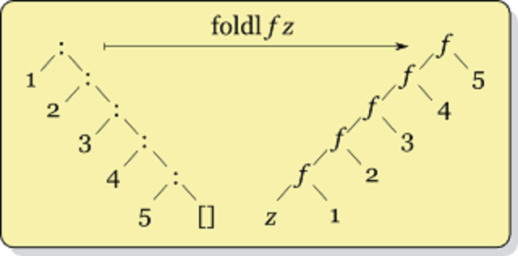

- title : Eventsourcing mit F#
- description : F# und RemmiDemmi Vortrag
- author : Carsten König
- theme : beige
- transition : default

***

##

## Eventsourcing mit F#
Carsten König

***

### Was ist Eventsourcing

nicht der **Zustand**

sondern die **Ereignisse**

die zu diesem Zustand geführt haben werden gespeichert.

---

### Beispiel Konto

---

#### Anstatt

Speichern des aktuellen **Zustands = Guthaben**

> jetzt beträgt ihr Guthaben `15€`

---

#### Ereignisse

Werden die **Ereignisse = Ein- und Auszahlungen** gespeichert

- am `01.01` erfolgte eine `Einzahlung` von `50€`
- am `02.01` erfolgte eine `Auszahlung` von `40€`
- am `03.01` erfolgte eine `Einzahlung` von `5€`
- ...

---

### Begriffe

- **Aggregate**  = das Domänen-Objekt für das wir uns interessieren (Konto)
- **Event**      = beschreibt eine Änderung an einem Aggregat (Ein-/Auszahlungen)
- **Stream**     = Abfolge von Ereignissen eines bestimmten Aggregats
- **Source**     = Verwaltet die Streams der einzelnen Aggregate
- **Projektion** = Berechnen eines Zustands aus den Ereignissen eines Aggregats

---

#### Heute geht es um ...

Wie bekomme ich **Zustand** aus **Ereignissen**?

***

### Szenario

Filme (Titel, Genre, Laufzeit) und Benutzerbewertungen

---

#### Model

    type Ereignisse =
        | FilmAngelegt        of Titel * Genre
        | LaufzeitHinzugefügt of Laufzeit
        | Bewertet            of Bewerter * Sterne
		
    type Sterne = 
        | EinStern 
        | ZweiSterne 
        | DreiSterne
		
---

#### Zustand

- Was ist der **Titel** des Films?
- Wie sieht die **Durchschnittsbewertung** aus?
- ...

---

#### Ziel-Projektion

    type Film =
        {
            Titel : Titel
            Genre : Genre
            Laufzeit : Laufzeit
            Bewertung : decimal
            AnzahlBewertungen : int
        }

***

### direkter Ansatz

rekursiv die Ereignisse durchlaufen

---

# DEMO

---

#### Beispiel

    let titel (evs : Ereignisse list) : Titel = 
        let rec letzterTitel aktTitel =
            function
            | []                          -> aktTitel
            | Angelegt (_,t)       :: evs -> letzterTitel t evs
            | TitelAktuallisiert t :: evs -> letzterTitel t evs
            | _                    :: evs -> letzterTitel aktTitel evs
        letzterTitel (Titel "---") evs

---

### Nachteile

- Code-Wiederholung und direkte Rekursion
- Ereignisse werden mehrfach durchlaufen
- `bewertungen` umfasst eigentlich `anzahlBewertungen`

***

## Fold

---

#### Muster ...

	let rec fold f acc xs = 
		match xs with
		| []      -> acc
		| (x::xs) -> fold f (f acc x) xs

	fold f initial ...

---

# DEMO

---

#### Beispiel

    let bewertung : Ereignisse seq -> decimal = 
        Seq.fold 
            (fun (wert, anzahl) ->
                function
                | Bewertet (_,EinStern)   -> (wert+1, anzahl+1)
                | Bewertet (_,ZweiSterne) -> (wert+2, anzahl+1)
                | Bewertet (_,DreiSterne) -> (wert+3, anzahl+1)
                | _                       -> (wert, anzahl))
            (0,0)
        >> function
            | wert, anzahl when anzahl > 0 -> 
                decimal wert / decimal anzahl
            | _ -> 0m
---

### Immer noch...

- Ereignisse werden mehrfach durchlaufen
- `bewertungen` beinhaltet eigentlich `anzahlBewertungen`

***

## Projektionen

---

#### Muster ...

        Seq.fold 
            foldFun
            init
	    >> proj

---

#### neue Abstraktion:

	type Projection<'s,'event,'result> = {
		Fold : 's -> 'event -> 's
		Proj : 's -> 'result
		Init : 's

---

#### geändertes Interface

	type IEventStream =
		abstract Add       : event:'event -> unit
		abstract Read      : p:Projection<'s,'e,'r> -> upper:VersionBound -> 'r

---

#### Kombinatoren

    let createP f i p : Projection<_,_,_> =
        { Fold = f
        ; Init = i
        ; Proj = p }

    let inline sumByP (select : 'event -> 'num option) =
        createP
            (fun sum ev ->
                match select ev with
                | Some nr -> sum + nr
                | None    -> sum)
            LanguagePrimitives.GenericZero
            id

    let countByP (select : 'event -> bool) =
        let toNum = 
            function 
            | true  -> Some 1 
            | false -> None
        sumByP (select >> toNum)

---

# DEMO

---

#### Beispiel

    let anzahlÄnderungen : Projection<_,_,int> = 
        countByP
            (function
            | TitelAktuallisiert _ -> true
            | _                    -> false)

---

### Was fehlt

- Ereignisse werden mehrfach durchlaufen
- *kombinieren*

***

## Parallele Projektionen

---

### Idee

Übergang zu **Paaren** von *Projektionen*

- Zustand -> Zustand A * Zustand B
- komponentenweise `Fold`
- komponentenweise `Proj`

---

    type Pair<'a,'b> = { 
        First : 'a
        Second : 'b 
        }

    let parallelP
        ( pa : Projection<'sa,'event,'ra>
        , pb : Projection<'sb,'event,'rb>) 
        : Projection<Pair<'sa,'sb>,'event,'ra*'rb> =
        { 
            Init = { First = pa.Init; Second = pb.Init } 
            Proj = fun pair -> 
				(pa.Proj pair.First, pb.Proj pair.Second)
            Fold = fun pair ev ->
                let fst = pa.Fold pair.First ev
                let snd = pb.Fold pair.Second ev
                { pair with First = fst; Second = snd }
        }
		
---

### Problem

Verlieren etwas die Kontrolle über den *Ergebnis*-Typ

---

### Funktor

    let fmap 
        (f : 'a -> 'b) 
        (pa : Projection<'s,'event,'a>) 
        : Projection<'s,'event,'b> =
        {
            Init = pa.Init
            Fold = pa.Fold
            Proj = pa.Proj >> f
        }

---

#### Beispiel

    let zeitraum : Projection<_,_,Zeitraum> = 
        let von =
            lastP
                (function Gestartet t -> Some t | _ -> None)
                DateTime.MinValue
        let bis =
            lastP
                (function Beendet t -> Some t | _ -> None)
                DateTime.MinValue
        parallelP (von, bis)
        |> fmap (fun (v,b) -> { Von = v; Bis = b })		
---

# DEMO

---

### Vorteile

- Projektionen sind kombinierbar
- Ereignisse werden nur einmal durchlaufen

---

### Nachteile

	let zusammenfassung' =
		parallelP (sprecher,
			parallelP (titel, 
				parallelP (anzahlÄnderungen, 
					parallelP (zeitraum,
						parallelP (bewertung, anzahlBewertungen)))))
	    |> fmap (fun (s, (t, (anzÄ, (z, (b, anzB))))) ->
		{
			Sprecher          = s
			Titel             = t
			AnzahlÄnderungen  = anzÄ
			Zeitraum          = z
			Bewertung         = b
			AnzahlBewertungen = anzB
	    })

***

## applikativer Funktor

---

#### Implementiert

    let pureP value =
        {
            Init = ()
            Proj = fun _ -> value
            Fold = (fun _ _ -> ())
        }

    let aMap   
        (pf : Projection<'sf,'event,'a -> 'b>) 
        (pa : Projection<'sa,'event,'a>) 
        : Projection<Pair<'sf,'sa>,'event,'b> =
        parallelP (pf, pa)
        |> fmap (fun (f,a) -> f a)
		
---

#### Operatoren

    let (<*>) = aMap
    let (<*) f a = (pureP f) <*> a

---

### Idee

- bringe eine Funktion `f` in *Curry*-Form mit `pureP f` in eine Projektion
- reduziere deren *Stelligkeit* mittels `aMap` der Reihe nach durch *Argument-Projektionen*

---

#### ... mit Typen

Erinnerung:

`aMap : Projecton<_,_,'a->'b> -> Projection<_,_,'a> -> Projection<_,_,'b>`

Wenn jetzt

    f : 'a -> ('b -> 'c)
    pa : Projection<_,_,'a>
    pb : Projection<_,_,'b>

dann ist

    pureP f : Projection<_,_,'a->('b->'c)>
    pureP f <*> pa : Projection<_,_,'b->'c>
    (pureP f <*> pa) <*> pb : Projection<_,_,'c>

---

#### Beispiel

    let zusammenfassungConst s t anzÄ z b anzB =
        {
            Sprecher          = s
            Titel             = t
            AnzahlÄnderungen  = anzÄ
            Zeitraum          = z
            Bewertung         = b
            AnzahlBewertungen = anzB
        }

    let zusammenfassung : Projection<_,_,Zusammenfassung> =
        zusammenfassungConst
        <* sprecher <*> titel 
        <*> anzahlÄnderungen <*> zeitraum
        <*> bewertung <*> anzahlBewertungen
		
		
---

# DEMO

***

## Snapshots

---

### Idee

Der innere *Zustand* der Projektionen

    type Projection<'snapshot,'event,'result> = ...
	
**ist** der Snapshot

---

	type Snapshot<'snapshot> = 
		{
			AggregateId : AggregateId
			Version     : AggregateVersion
			Value       : 'snapshot
		}
		
---

#### neue Schnittstelle

	type IEventStream =
		abstract Add           : event:'event -> unit
		abstract TakeSnapshot  : p:Projection<'s,'e,'r> -> upper:VersionBound -> unit
		abstract Read          : p:Projection<'s,'e,'r> -> upper:VersionBound -> 'r
		
---

## parallelen Projektionen

---

### Beispiel

    bewertung : Projection<Pair<Pair<unit,int>int>,_,_> = 
	    ...
        fun wert anzahl -> ...
        <* summeBewertungen <*> anzahlBewertungen

- `unit` kann ignoriert werden
- erste `int` von `summeBewertung`
- zweite `int` von `anzahlBewertung`

---

### Problem

- wie bei unterschiedlichen **Versionen** vorgehen
- wie die beiden `int` Unterscheiden?

---

### Lösungen Versionen

im `Fold` der Projektion die Version mit übergeben

	type Projection<'s,'event,'result> = {
		Fold : 's -> 'event * AggregateVersion -> 's
		Proj : 's -> 'result
		Init : 's
		}
		
---

`Pair<..>` erweitern:

    type Pair<'a,'b> = { 
        First  : AggregateVersion * 'a
        Second : AggregateVersion * 'b 
        }

und in `parallelP` nur bei höherer Version *folden*:

    let parallelP ... =
        { 
            Init = ...
            Proj = ...
            Fold = fun pair (ev, ver) ->
                match pair with
                | { First = (verA,sA); Second = (verB, sB) } -> 
                    let fst = 
                        if ver > verA
                        then (ver, pa.Fold sA (ev, ver))
                        else (verA, sA)
                    let snd = ...
                    in { First = fst; Second = snd }
        }

---

### Lösung doppel-`int`

**Phantomtypen** einführen

    type Summe<'label,'a> = Summe of 'a

    let inline sumByP 
        (label : 'label) 
        (select : 'event -> 'num option) 
        : Projection<Summe<'label,'num>,_,'num> =
        createP
            (fun (Summe sum) (ev,_) ->
                match select ev with
                | Some nr -> Summe (sum + nr)
                | None    -> Summe sum)
            (Summe LanguagePrimitives.GenericZero)
            (fun (Summe num) -> num)

---

und zur Unterschiedung verwenden

    type AnzahlBewertungen = AnzahlBewertungen
    let anzahlBewertungen : Projection<_,_,int> =
        countByP AnzahlBewertungen
            (function
                | Bewertet _ -> true
                | _          -> false)

damit hat `bewertung` den Typ

    Projection<
	    Pair< 
			Pair< 
				unit,
		        Summe<SummeBewertungen,int> 
			>,
	        Summe<AnzahlBewertungen,int> 
		>
	>

---

# DEMO

***

# Vielen Dank!

**Carsten König**

- Twitter: [CarstenK_dev](https://twitter.com/CarstenK_dev)
- Email:   [Carsten@gettingsharper.de](mailto:Carsten@gettingsharper.de)
- Web:     [gettingsharper.de](gettingsharper.de)
